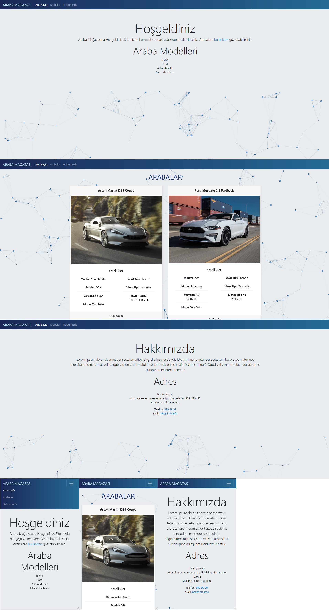

# bootstrap-odev-1
patika.dev / kodluyoruz.org Bootstrap eğitiminin 1. ödevi 

## Istenilenler

css-odev1 deki sayfayinin bootstrap kullanilarak yeniden tasarlanmasi
- HTML kısmını önceki ödevden alabilirsiniz fakat baştan yapmanızı öneririz.
- Menüyü koyu renkli olarak düzenleyin. İsterseniz arka plan rengi de verebilirsiniz.
- Ana sayfaya bir jumbotron koyup içeriğinizin açıklamasını yazınız.
- Arka plan rengini #E9ECEF ile değiştirin.
- Ürünlerimiz sayfasında card yapısını kullanın.
- Kullandığınız card yapısını grid sistemin içinde kullanın.
- Ürün card boyutlarının tamamen aynı olduğuna dikkat edin.
- Hakkımızda sayfasını da bir card yapısı içine alın.
# Sonuç

## Bilinen Sorunlar
- "products.html" sayfasinda container'in particle.js arkaplaninin üzerinde konumlanmasi ve responsive özelligi korumak icin position: fixed; kullaniliyor (absolute çözünürlük değiştiğinde yapıyı eski haline alamıyor) ve bu sebepten dolayi sayfada scroll yapilamiyor. 
- card ögelerinde yazilarin bulundugu grid/col genisliginin veya card ögelerinde bulunan yazilarin uzunluguna göre card boyutu degisime ugruyor.   
